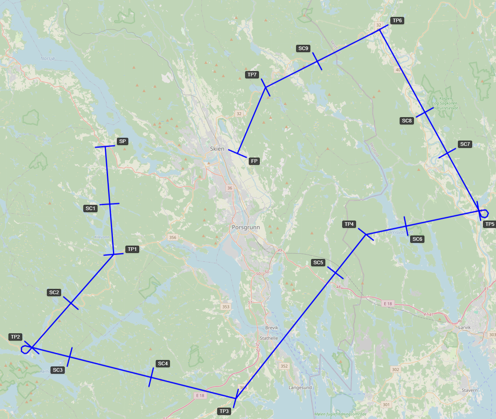
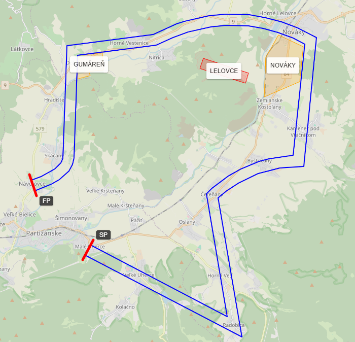
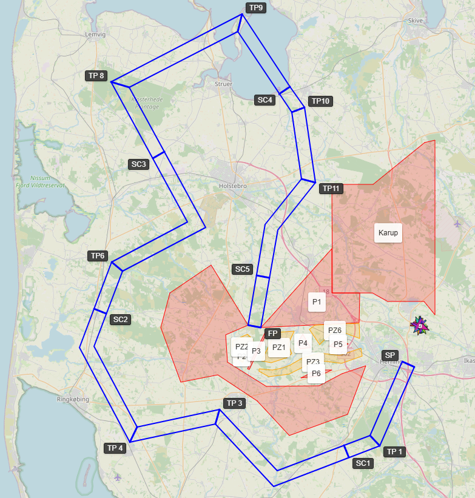
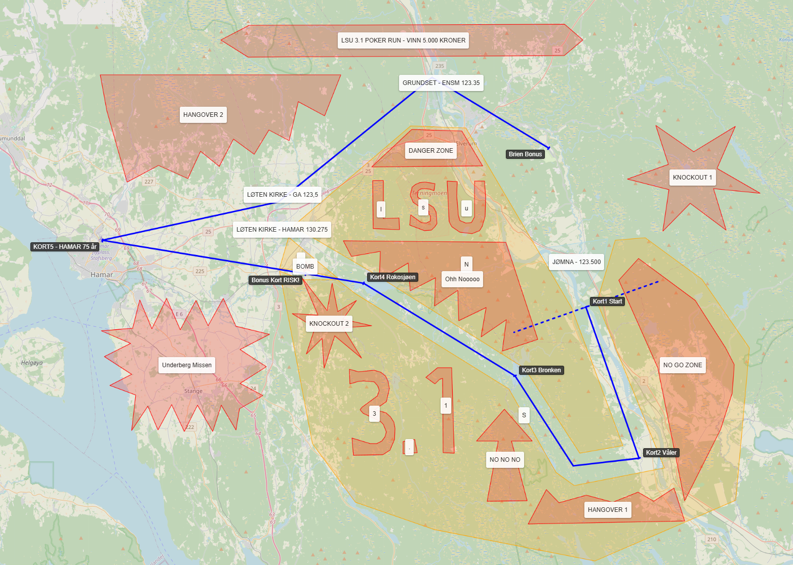

# Competition Types and Scorecards: Defining the Rules

Every competition type in ASLT is governed by a **Scorecard**, which defines the penalties applied by the calculation engine. This guide explains how to select and customize these rules.

---

## 1. Primary Competition Types

### Precision Flying (Standard Navigation)
This is the "Formula 1" of precision navigation.

*   **Scoring Logic:** Pilots are judged on their ability to fly a predefined track and arrive at waypoints at a precise second. 
*   **Observation Element:** Tasks often include an observation element where pilots must recognize ground features such as canvases spelling out symbols or specific observation photos. These must be recognized and correctly marked on the map while flying.
*   **Flight Planning:** Before takeoff, contestants undergo a theoretical flight planning test. They are scored on the accuracy of their route calculations—including headings and timings—while correctly accounting for wind components.
*   **Common Penalties:**
    *   **Timing:** Penalty points for every second early or late at each gate.
    *   **Bad Crossing:** Penalties for crossing a gate in the wrong direction or at an extreme angle.
    *   **Backtracking:** Heavy penalties (e.g., 200 points) for flying backwards relative to the leg.
    *   **Missed Gate:** A massive penalty (e.g., 100 points) for skipping a waypoint.

### ANR (Air Navigation Race)
A modern, spectator-friendly format.

*   **Scoring Logic:** Pilots must stay inside a "Corridor" and arrive at the finish at a target time.
*   **Common Penalties:**
    *   **Corridor Breach:** Penalty points per second spent outside the corridor.
    *   **Backtracking:** Heavy penalties (e.g., 200 points) for flying backwards relative to the leg.
    *   **Prohibited Zones:** Penalties for entering "Danger Zone" polygons drawn on the map.

### Air Sports Challenge
A hybrid format merging Precision Flying and ANR into a single high-intensity challenge.

*   **Scoring Logic:** Pilots must maintain precise timing while navigating a corridor with varying constraints. These routes are typically short but dense with technical elements.
*   **Common Features:**
    *   **Variable Corridor:** The corridor width is not fixed; it varies based on the size of each gate along the route.
    *   **Precision Timing:** Features multiple timing gates and secret gates, exactly like Precision Flying, requiring strict adherence to the flight plan.
    *   **Dynamic Obstacles:** Prohibited and penalty zones can be placed anywhere—before the start, after the finish, or even directly inside the corridor.

### Pilot Poker Run
A casual event where "cards" are the primary result.

*   **Scoring Logic:** The system grants a playing card each time a pilot enters a designated **Gate Polygon**.
*   **Common Rules:** Often used for fun fly-ins. The "winner" is determined by the final poker hand rather than flying precision.

---

## 2. Anatomy of a Scorecard

As a Contest Manager, you can customize almost every aspect of the scoring.

### General Parameters
*   **Initial Score:** Start with 0 or a positive number (if penalties are subtracted).
*   **Score Sorting Direction:** Is the winner the person with the **Lowest** (Ascending) or **Highest** (Descending) score?

### Timing Penalties (per Gate Type)
*   **Penalty per Second:** How many points are lost for each second early/late.
*   **Grace Period (Before/After):** The number of seconds a pilot can be off-time *without* penalty (e.g., a 2-second grace period is standard for FAI precision).
*   **Missed Penalty:** The fixed penalty for not crossing a gate.
*   **Maximum Penalty:** The cap on points lost at a single gate.

### Logic Penalties
*   **Backtracking Bearing:** The angle (e.g., 90 degrees) that triggers a backtracking penalty.
*   **Backtracking Grace Time:** How many seconds a pilot is allowed to fly backwards (to correct a turn) before being penalized.
*   **Prohibited Zone Grace Time:** How many seconds a pilot can "clip" a danger zone before a penalty is applied.

---

## 3. How to Customise Your Rules

### The Inheritance Model
1.  **Global Defaults:** ASLT includes "Original" scorecards based on FAI and national rules.
2.  **Navigation Task Override:** When you create a task, the system creates a **copy** of the scorecard specifically for that task.
3.  **Modification:** You can edit the parameters of this copy without affecting other tasks. For example, you can double the "TP Missed" penalty for a difficult leg.
4.  **Field Visibility:** To keep the interface clean, you can select which scorecard fields are visible to the pilots, allowing you to hide complex backend parameters while showing the key rules they need to follow.

### Resetting
If you make a mistake while customizing a scorecard, you can always use the **"Restore from Original"** button to reset the task's rules to the standard template.
